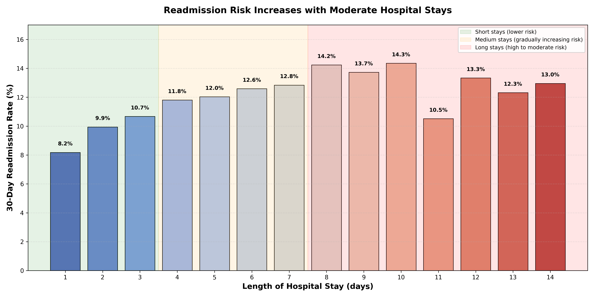

# **Turning Hospital Data Into Fewer Return Visits for Patients**

## Hook

What if hospitals could identify which patients are most likely to return before they even leave? By using patient data to study readmission risk, it is now possible to spot high-risk patients before they even leave the hospital.

## Problem Statement

Hospital readmissions are a major challenge for both patients and healthcare providers. Patients may return to the hospital within 30 days of discharge due to complications or lack of follow up care. This may indicate gaps in the quality of healthcare provided, cause significant physical and emotional strain, and impose financial stress on patients. Hospitals may face increased costs and utilize resources inefficiently due to readmissions. The overall efficiency of healthcare can be improved by reducing preventable readmissions, allowing both patients and healthcare providers to benefit from better health outcomes and reduced costs. This problem raises the question: How can we predict which patients are at high risk of readmission within 30 days of hospital discharge, and what are the most influential clinical and demographic factors contributing to that risk? By addressing this question, we can develop predictive models that help healthcare providers identify who to look out for before discharge, so that they can provide targeted interventions to reduce the likelihood of readmission.

## Solution Description

We developed a predictive tool that estimates the likelihood of a patient being readmitted to the hospital within 30 days of discharge. This means that after a patient is discharged, the tool analyzes their clinical and demographic information to predict whether they are at high risk of returning to the hospital within the next month. Some factors known to influence readmission risk include age, health conditions, and even psychosocial factors such as patient engagement. By analyzing these factors, healthcare providers have another set of tools to help them make informed decisions about which patients may need more attention or follow-up care after discharge. Overall, the goal is to use data to ensure patients receive optimal care and support, and to avoid unnecessary readmissions that can be stressful for patients and costly for healthcare systems.

## Chart

The bar chart shows how hospital readmission risk changes as length of stay increases. The x-axis represents the length of hospital stay in days, while the y-axis represents the mean readmission rate for patients with that length of stay. The chart illustrates that as length of stay increases, the readmission risk also tends to increase then decrease, suggesting that patients with longer hospital stays may be at higher risk of being readmitted within 30 days of discharge.

